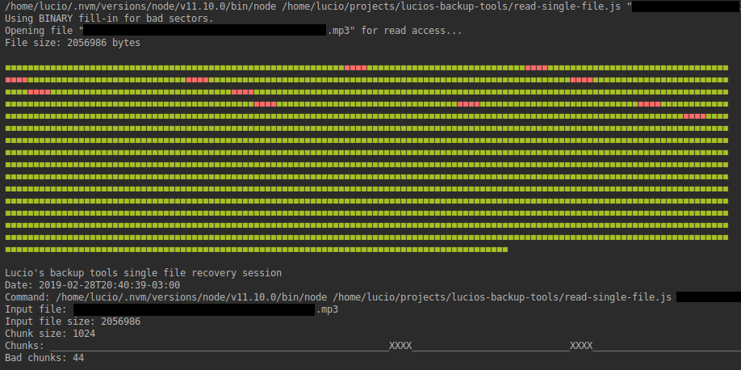
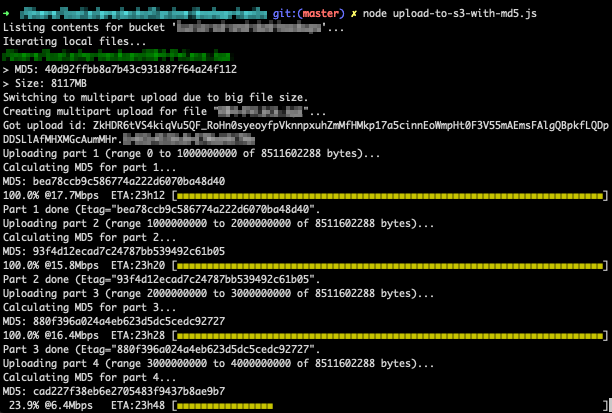

# Lucio's backup tools

This is a toolkit I made to help me backup my old CDs and DVDs to AWS.

*Reading file from source with bad sectors*

*Uploading 8GB multipart backup file to S3*

## How to install

### Node.js

The scripts need Node.js to run. Best is to use nvm to install the correct version needed by the tools. Refer to nvm home page for details on how to install it.

Once nvm is installed, run the following command at the root of this repo:

    nvm install

It will download and install the correct Node.js version locally.

### AWS access key

Needless to say, you need an AWS account. Generate an IAM access key with full S3 access and create a file at `$HOME/.aws/credentials` with it (or add it to your environment vars), otherwise scripts will fail.

### config.json

Last, create a `config.json` file based on `config.json.template` and specify:

- bucket name in S3 where files will be saved
- directory with files to upload to S3
- list of extensions the script should care about when choosing which files to upload

## How to use these tools

Typical recovery scenario:

- if the CD is single-session, use some tool like K3b and rip it all at once. If it succeeds, done
- if the CD is multi-session or the above failed, then run `old-stuff/backup-mounted-to-tar.sh`
  this will output a list of files that failed
- considering some files failed, you can now try `retry-failed-files.js` and see if reading again solves the problem at least for some of them
- if the files still fail, depending on the file you should be fine with recovering just parts of it (some text file, images, etc). For that, use `read-single-file.js`. It will recover all sectors it can, showing you how many failed and filling in the output file to compensate for the failed sectors

### Example backup scenario

I have a folder with lots of files to back up. First I compress them using tar:

    tar -czvf backup.tgz path-to-folder-with-files-to-backup

Then I move the tgz file to the folder specified by the `path` property in `config.json`. Now I generate the md5 checksum by running:

    md5 backup.tgz > backup.md5

Once the md5 checksum is computed, I can use it to validate the file:

    node verify-md5

It should show something like this:

    /Users/myuser/my-backups/backup.tgz
    PASSED

Now I make sure that my AWS credentials are set in `~/.aws/credentials`. They must be generated in the IAM service panel with full S3 access permissions. The credentials file should look like this:

    [default]
    aws_access_key_id=NSDKCJNSDKCJSDKN
    aws_secret_access_key=NAKSDCJNAKSD2489nDCSKCDJ

If `aws` CLI tool is installed, `aws configure` can be used to set up the access key.

Finally, run the upload script:

    node upload-to-s3-with-md5.js

## Tools

### upload-to-s3-with-md5.js

Given a local folder, uploads all relevant files (relevant extensions configurable via config.json) to S3, also validating them after they're uploaded via the MD5 AWS HTTP header. If remote file doesn't match the hash, the script will warn you.

The script first checks which files already exist in the bucket and skips them (it tells you in case it does).

The script also handles files bigger than 5GB, which require multipart upload. It will very likely handle faults by itself. In case it doesn't, however, it's easy to manually fix things. You just need to make sure that the upload is properly aborted. To do that, check your bucket for open uploads:

    aws s3api list-multipart-uploads --bucket BUCKETNAME

If it returns an empty response, it's all fine. If it returns a JSON containing your upload id, you want to abort it using the following command:

    aws s3api abort-multipart-upload --bucket BUCKETNAME --key "FILE-KEY" --upload-id "UPLOAD-ID"

Then run the list command again to confirm it's gone.

### verify-md5.js

Given a local folder, this script checks all relevant files (.iso) to see if their hashes match their companion .md5 files. If there's a file named `some-file.iso`, the script will look for `some-file.md5` and see if its contents match the calculated MD5 hash for the file.

This task takes some time for big files (we're talking 100MB or greater) since the MD5 has to be calculated.

### verify-mirror.js

When saving backups of my CDs and DVDs and before actually uploading to the cloud I keep one extra copy of each ISO and TAR file in a separate hard disk as well, in case the first one eventually fails.

I was suspecting that I may have screwed up one of the copies, so I decided to write this script to verify that MD5 files in one disk match MD5 files on the other. `verify-md5.js` will do the job of verifying that MD5 files are matching the correct file hash and `verify-mirror.js` will make sure that MD5s across disks are also consistent.

### retry-failed-files.js

When you use tar to copy files from a CD, it will print to stderr those whose copy failed. You can redirect stderr to a file and use as input to this script and it will retry those failed files, creating a new tar in the process.

### read-single-file.js

If some file is sitting right where a bad sector is, you want to try this script. It will read chunk by chunk, seeing what it can recover. For chunks that fail, it just fills in the output file with either text or 0x00 (depending on the file extension).

### compare-directories.js

As the name implies, this script receives the path to two directories and compares them. The comparison is made file by file, checking whether the file exists in both folders and also if their sizes and modification dates match.

### tar-outcome-treeview.js

This script compares stdout and stderr outputs from tar to highlight which files failed in a tree-like folder structure. If helps to understand the magnitude of the problem when some medium has bad sectors.

### compute-md5-files-in-dir.js

Quick script to generate md5 for all files in the working directory whose extensions are known. One md5 file will be created for each file.

## What I learned

These are some random notes I want to make right now before I forget.

It looks like some CD-Rs age to the point where they become unreadable. Even media with few to no scratches become unrecoverable. It may be simply due to the way the technology works and CD-RWs would be even more problematic. Some CD-Rs from late 90s are still perfectly readable to this date (2019). It could be that those CDs were kept more protected than the ones failing, but at least they were kept under the same environment conditions (temperature and humidity). Some media became unreadable with just 5 years of storage.

Beware that some rescuing tools only see the first session and you might miss data from multi-session CDs if you are not aware of that.

Beware of the way you copy your data from the CD as well, as you might lose date information. I found out that `tar` is an excellent tool to backup data, not only because it keeps the original modification dates, but also because it dumps the list of files which it failed to copy but it does not stop when it encounters them.

A caveat is that `tar` still lists failed files inside the final tar file. If it's able to read part of the file, it will save the part it read and just fill the rest of the file with zeroes. Because of that, it's nice to keep the list of files that failed together with the final tar file so that you know exactly which files had their integrity compromised. This is what the tar output looks like:

    tar: path/to/some/file.ext: File shrank by 280886 bytes; padding with zeros

In the case above, it means that we lost 280886 bytes when reading and tar warns us that it appended that many number of zeroes. Every time I saw this happening, it was in the end of the file, i.e., it seems that tar probably just gives up reading the rest of the file as soon as it encounters the first problem. It may be an operating system thing, though.

I also tried cleaning a CD-R, first with soap, then with toothpaste. I made sure to scrub the surface gently from the center straight to the edges and I also let the toothpaste dry a bit before washing it out. Results are inconclusive. Although I managed to get a few files that I couldn't copy before, it can be that there was pure luck the reader was able to read better this time. I'd have to test this more to come to a better conclusion.

### The 0x573A0000 mystery

Of the 4 media that presented issues when doing a backup of all my CDs/DVDs, 3 of them had the same exact problem: the first 0x573a0000 bytes were perfectly readable, but the rest simply failed. I tried ddrescue and Nero Burning ROM (the same program that burned them in the first place - I know because it's written in the metadata section of the DVDs), but to no avail. They all stop reading at sector 714560 (and each sector has 2048 bytes, totalling 0x573a0000 bytes). It smells like some problem during recording, since all 3 look like they were recorded on the same day. All 3 are Kodak DVD-R media, so it can be something wrong with the DVD itself, or it was Nero that failed. If I had them tested on the same day, they would have probably failed just the same - it doesn't look like they aged or something.
