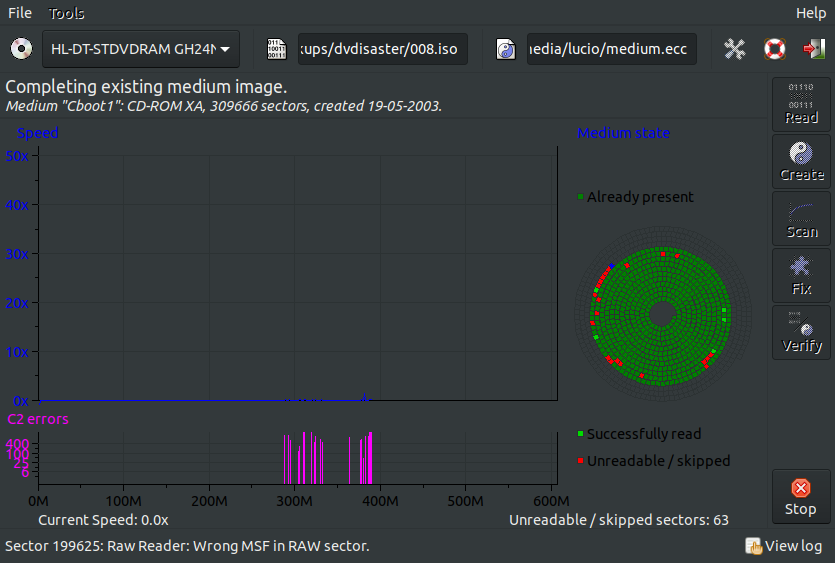

# dvdisaster

Can be installed by running:

    sudo apt-get install dvdisaster

Found about it in ddrescue's documentation. It says dvdisaster would be advised specifically for CD-ROMs.

dvdisaster's great feature seems to be actually recording with error correction, not recovering. Nevertheless, you can recover with it as well. It has a GUI and it's very handy.

## First read

There's a lot of settings to be configured. One of them tells what to do when dvdisaster finds a bad sector. You can tell it to skip X sectors after that. It's useful to quickly identify where chunks of bad sectors are, to give a rough estimate of the percentage of the medium that is failing.

## Retrying

Once you let it finish one full pass, an .ISO file is generated. If you click the "Read" button once more, it will pick up from where it stopped, i.e., if there were skipped sectors in the first pass and now you've configured it to not skip sectors, it will just keep everything that was successfully read the first time (it'll show those sectors as "Already present") and attack only those skipped ones.

## Cannot identify files

dvdisaster is not very different from ddrescue because it only cares about sectors. It doesn't know about files and usually we care about certain files and we don't want to lose time trying to recover the other ones.
